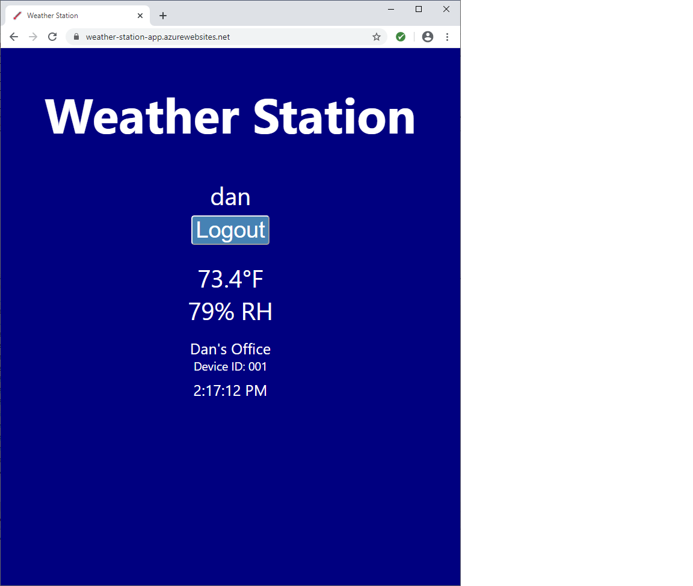

# Weather Station

* **Purpose of the project:**
   Build a battery operated weather sensor which reports readings using LoRaWAN over a public gateway connected to The Things Network (TTN). Collect reported readings, save them to a database, and provide a client website to view the latest readings.   

* **How to use:**
   Go to https://weather-station-app.azurewebsites.net  Register a username & password or use 'guest' and 'demo' to access the site.

* **Features of the application:**
   A user may register and login with a username and password or use the guest account as described above.  The current temperature and humidity readings will be displayed along with the time of the report, when a new reading is received from the sensor the display will update.

## Site Preview

## Live link:
- [Weather Station](https://weather-station-app.azurewebsites.net)

## This application was built by
- [Dan Ochs](https://github.com/DanOchs99)

## Database:
- PostgreSQL

## Hardware:
- Edge device: TinyZero microcontroller, Temperature/Humidity TinyShield, Proto Terminal Blocks TinyShield (TinyCircuits); RAK811 LoRa Breakout Module (RAK Wireless)

- Gateway: Raspberry Pi 4 Model B; RAK2245 RPi HAT Edition LoRaWAN Gateway Concentrator Module (RAK Wireless); Raspberry Pi Universal HAT Size Case DIY Kit - Protective Acrylic Case for Raspberry Pi 4 Model B (Geekworm); 900MHz Antenna Kit 3.5Dbi External Omni Rubber Duck Indoor Antenna with RP-SMA Connector + IPX U.fl to RP-SMA Cable Pigtail (wlaniot)

## Project dependencies:
- Edge device: Si7021 Arduino Library (https://github.com/TinyCircuits/TinyCircuits-TinyShield-Sensor-ASD2511/raw/master/libraries/SI7021.zip)

- Gateway: Raspian Buster Lite, RAK Wireless Firmware (https://github.com/RAKWireless/rak_common_for_gateway.git)

- Server: Node.js, Express.js, ttn, bcrypt, dotenv, cors, jsonwebtoken, pg-promise, socket.io

- Client: React.js, Redux
