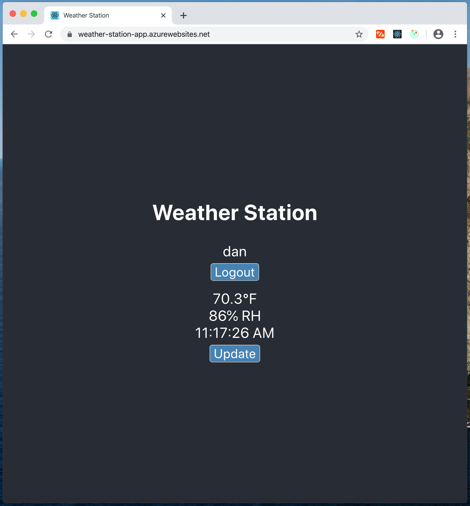

# Weather Station

* **Purpose of the project:**
   Build a battery operated weather sensor which reports readings using LoRaWAN over a public gateway connected to The Things Network (TTN). Collect reported readings, save them to a database, and provide a client website to view the latest readings.   

* **How to use:**
   Go to https://weather-station-app.azurewebsites.net  Register a username & password or use 'guest' and 'demo' to access the site.

* **Features of the application:**
   A user may register and login with a username and password or use the guest account as described above.  The current temperature and humidity readings will be displayed along with the time of the report, press the Update button to get the latest reading from the database. 

## Site Preview

## Live link:
- [Weather Station](https://weather-station-app.azurewebsites.net)

## This application was built by
- [Dan Ochs](https://github.com/DanOchs99)

## Database:
- PostgreSQL

## Hardware:
- Edge device: TinyZero microcontroller, Temperature/Humidity, Proto (TinyCircuits); RAK 811 Breakout (RAK Wireless)

- Gateway: Raspberry Pi 4 (Pi store??); RAK2245 RPi HAT Edition LoRaWAN Gateway Concentrator Module (RAK Wireless); case; antenna

## Project dependencies:
- Edge device: SI7021 library ()

- Gateway: RAK software... (RAK Wireless)

- Server: Node.js, Express.js, ttn, bcrypt, dotenv, cors, jsonwebtoken, pg-promise, socket.io

- Client: React.js, Redux
